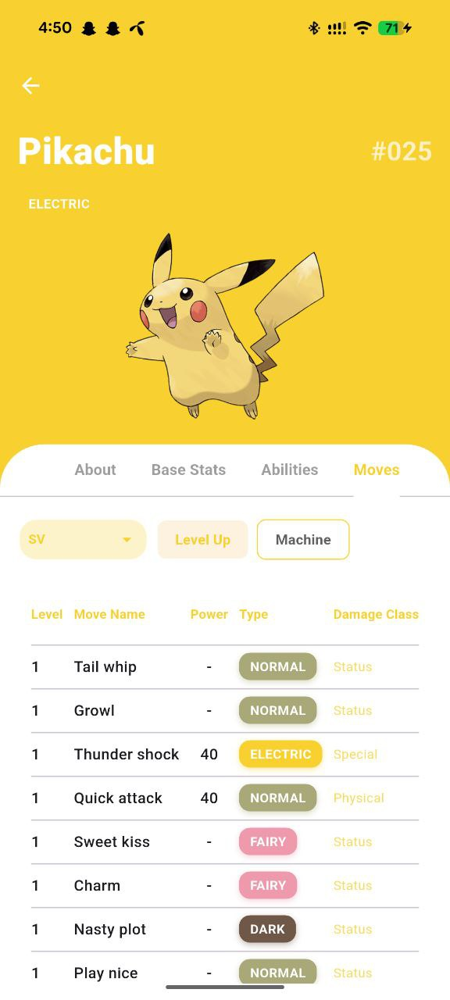
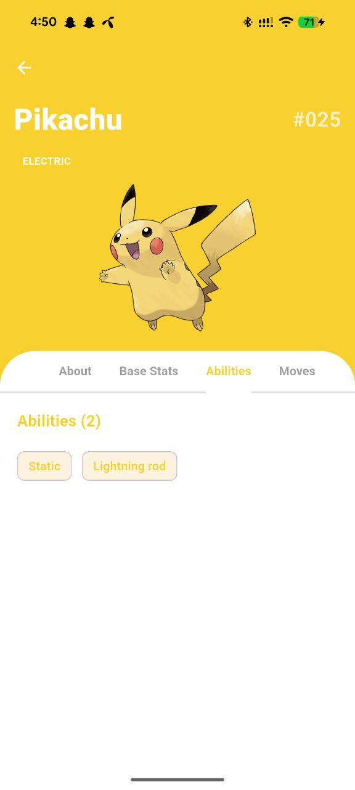
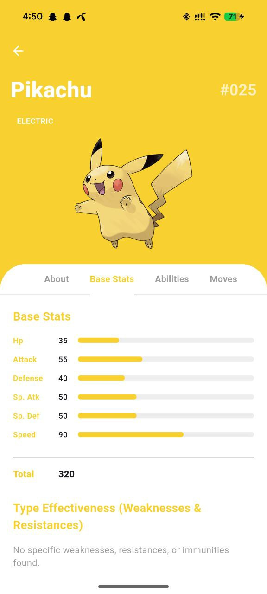
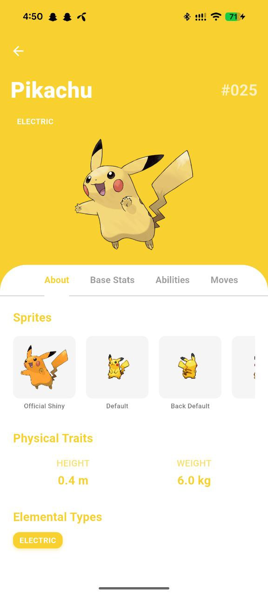
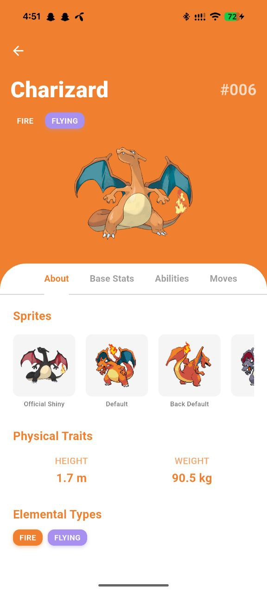

# Project Title and Description

# Pokédex Explorer :

It is a modern, performant mobile application built with Flutter that allows users to browse through the complete list of Pokémon and view detailed information for each one.
The app consumes the official PokéAPI and implements industry-best practices for state management, network efficiency, and user experience — including lazy loading/infinite scrolling to smoothly handle thousands of Pokémon without performance degradation.

## Features

- Infinite scroll (lazy loading)
- Full Pokémon details (stats, abilities, moves, types, etc.)
- Dual-type damage multiplier calculation
- Official Pokémon type colors
- Clean Architecture + BLoC pattern
- Cross-platform (Android & iOS)

## Tech Stack

- Flutter (Dart)
- flutter_bloc (BLoC pattern)
- http
- equatable

# Project Structure & Architectural Approach

## 🧱 Architecture Overview

This project follows **Clean Architecture + BLoC**, ensuring scalability, testability, and a clear separation of concerns.

## 📁 Clean Architecture Layers

````text
lib/
│
├── data/                 # API, models &repository implementations
│   ├── models/           # Pokémon data structures (JSON serialization)
│   └── repositories/     # Network/data access logic
│
├── domain/ (optional)    # Use cases (future-proof layer)
│
└── presentation/         # Flutter UI layer
    ├── bloc/ (module/)   # State management
    ├── screens/          # Home & Details pages
    └── widgets/          # Common UI components
````

## State Management (BLoC)

PokemonListBloc --> Displays and paginates Pokémon list Infinite scroll, next URL
PokemonDetailBloc --> Fetches detailed Pokémon info Type effectiveness, nested calls

## ⚡ Performance Optimization

To prevent performance issues when dealing with 1000+ Pokémon:

1. Initial load: limit=20 Pokémon
2. PokemonRepository extracts the next URL from the API response
3. ScrollController detects when user is near the end of the list
4. LoadMorePokemon event is dispatched → next batch is fetched and appended

# 🤝 Generative AI-Assisted Contributions

AI tools (Gemini / ChatGPT) were leveraged to improve development speed and code quality:

### 🚀 Performance

- Suggested & guided implementation of **lazy loading**
- Result: Smooth infinite scrolling with zero frame drops

### 🎯 Type Effectiveness Logic

- Helped design formula for **combined type multipliers**
- Result: Accurate damage relations (0×, 0.5×, 2×, 4×)

### For analyzing the API

- Helped in finding out what data can be fetching from the api

### 🎨 Theming & UI

- Generated **Pokémon type color palette**
- Result: Consistent, game-accurate visuals throughout the app

# How to Run

```bash
git clone https://github.com/tanbir114/Pokedex_flutter_bloc_cleancode.git
cd Pokedex_flutter_bloc_cleancode
flutter pub get
flutter run
````

# 📸 Screenshots

# Home Screen


# Detail Screen





